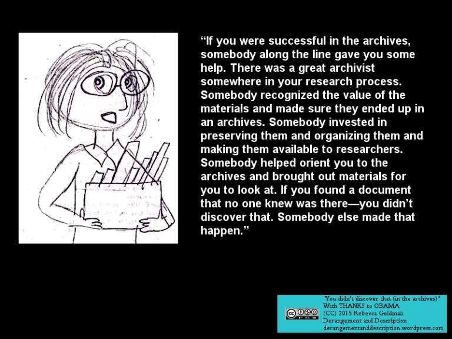

via [Derangement and Description:](https://derangementanddescription.wordpress.com/2015/06/16/you-didnt-discover-that-in-the-archives/)

> “If you were successful in the archives, somebody along the line gave you some help. There was a great archivist somewhere in your research process. Somebody recognized the value of the materials and made sure they ended up in an archives. Somebody invested in preserving them and organizing them and making them available to researchers. Somebody helped orient you to the archives and brought out materials for you to look at. If you found a document that no one knew was there—you didn’t discover that. Somebody else made that happen.”

Another archivist [notes](https://twitter.com/AceOnFire77/status/1300537848072941568) that

> That we collected/curated/cataloged/arranged/etc. the item, which led to the person locating the item within our library/archive. The item was already "discovered". (I dislike that term in general.)

[Ryan P. Randall,](https://twitter.com/foureyedsoul), a community college librarian tries to poise this question a different way:

> I ask them whether they meant "encountered"; what lead them to instead frame that person's initial encounter as a "discovery"; whose presence/ labor/ knowledge is eluded/ made invisible via that frame?

The University of Virgina has a handy discussion on this here: [Sylvia Plath’s new short story was never ‘lost’ – so why is the media saying it was ‘just discovered’?](https://news.library.virginia.edu/2019/01/28/10262/)

As does the [Ransom Center](https://sites.utexas.edu/ransomcentermagazine/2011/02/23/how-are-unpublished-manuscripts-unearthed-at-the-ransom-center/).