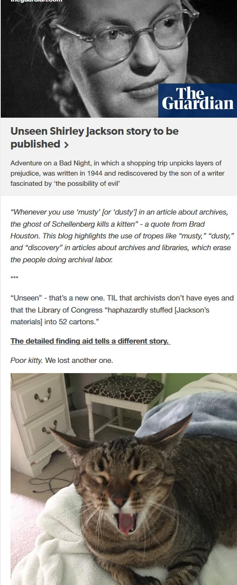

This is a common gripe among archivists. A number of experts [replied to this question](https://twitter.com/brimwats/status/1308814131949047808):

[Dr. Elizabeth Haven Hawley](https://twitter.com/ehh_ptr) of the University of Florida points out that

> If you can learn about it through Google, it definitely is not hidden. And usually you can.

[John Overholt](https://twitter.com/john_overholt), Curator of Early Books & Manuscripts, Houghton Library, Harvard University, posting a picture of very clean macbooks, says:

> Re: dusty, I always say that in fact we work very hard to make sure that isn't the case. We have air filtration, we even literally vacuum the stacks! Re: old, this is the last image in the Houghton 75th anniversary book.

This question makes [Emily Higgs](https://twitter.com/emilyhiggs24), Digital Archivist for the Friends Historical Library at Swarthmore College sad:

> “Hidden” makes me sad because sometimes it means we need to be doing better outreach and visibility work. “Dusty” makes me mad because it insults our custodial staff who are awesome and do their jobs very well

[Marya](https://twitter.com/maryaevh), a collections manager jokes that archivists should 

> just start doing it to other professions. "Scientists in a dusty biochemical lab recently engineered a functioning heart organoid..." "Deep in a hidden old courtroom, a judge today declared a mistrial..."

### Don't Kill Cats!
This is such a common joke that it has [become a meme](https://dustyarchivekittendeaths.tumblr.com/):

